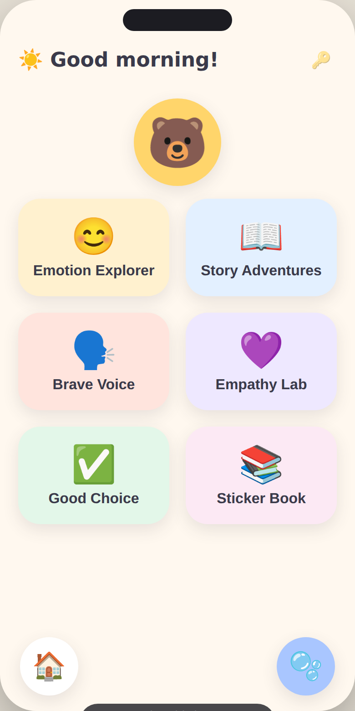
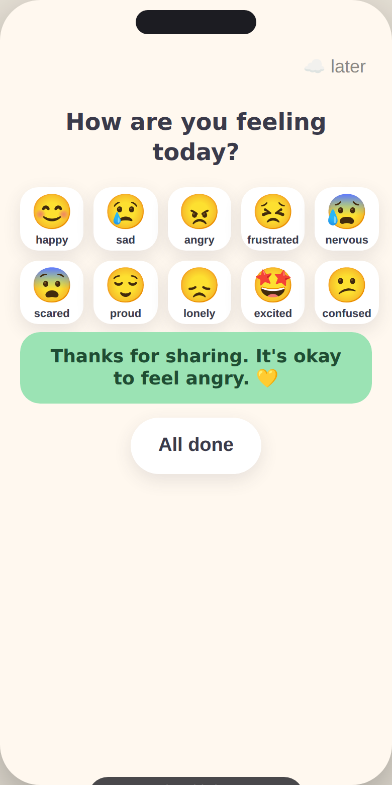
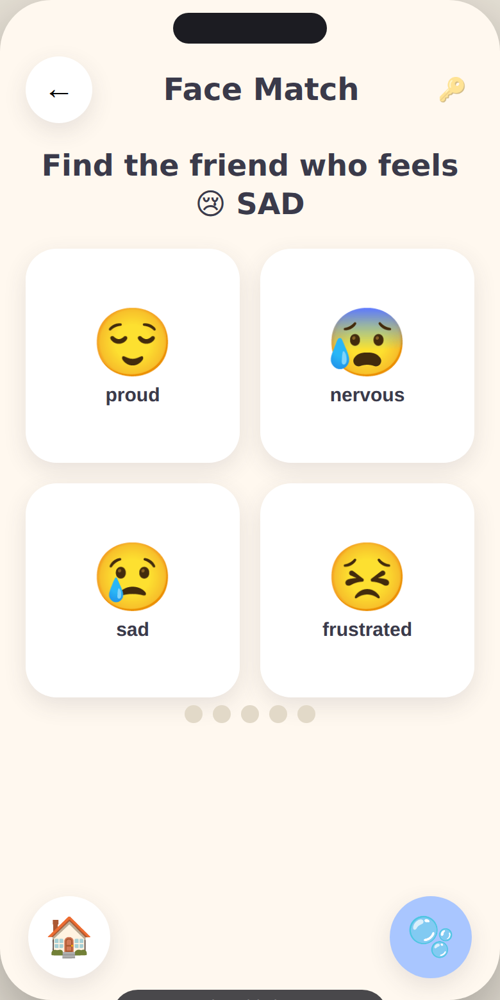
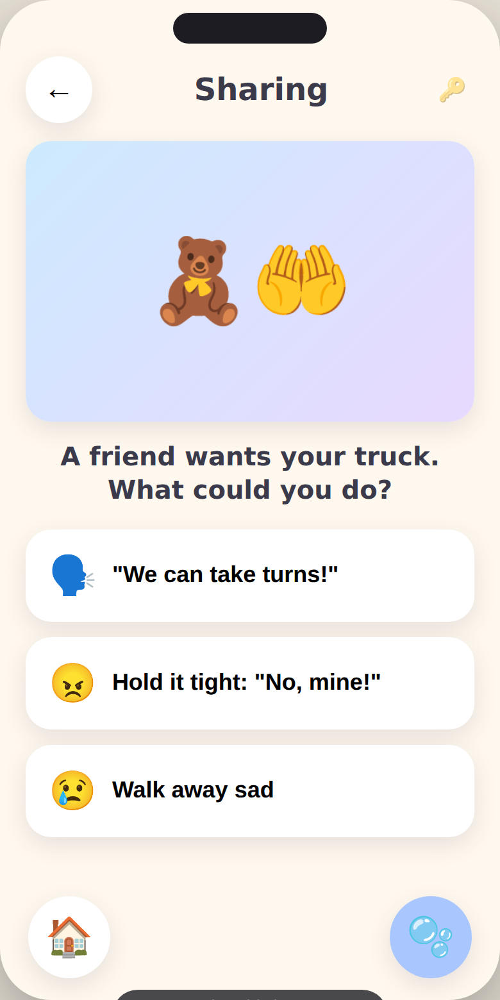
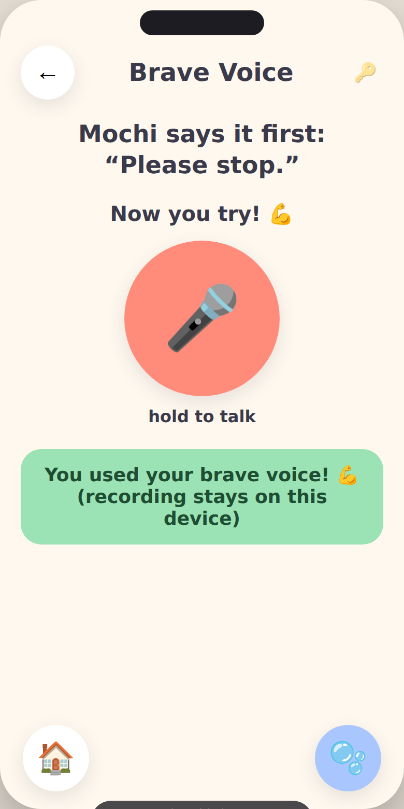
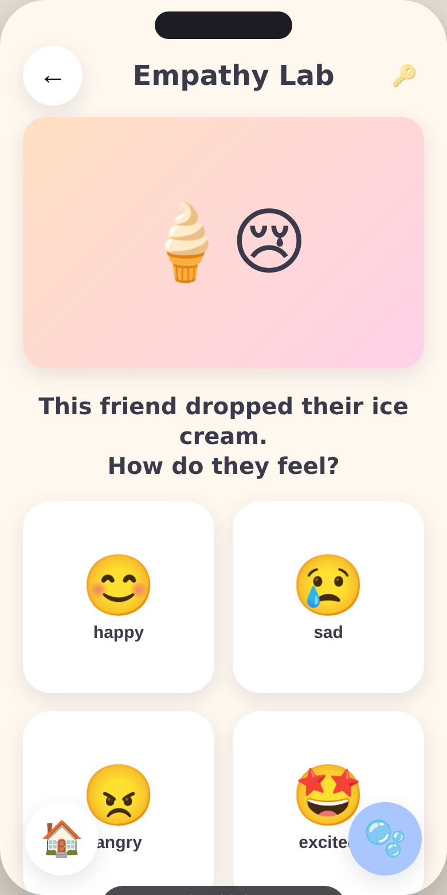
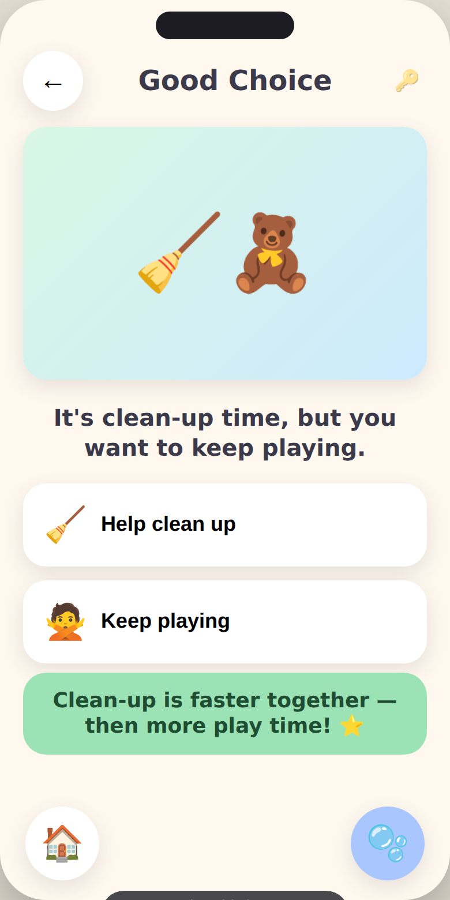
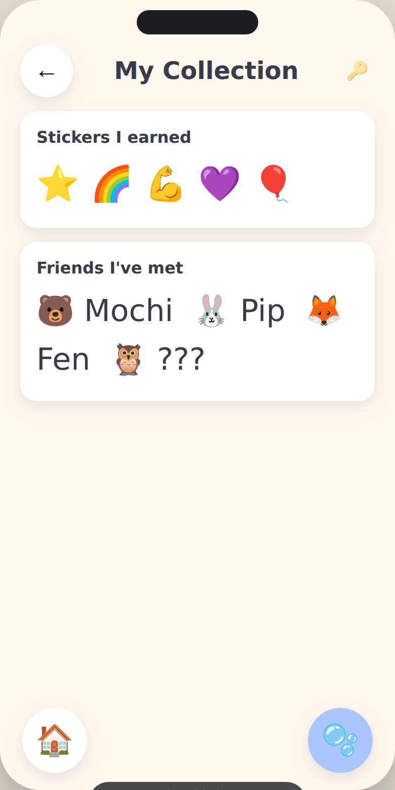
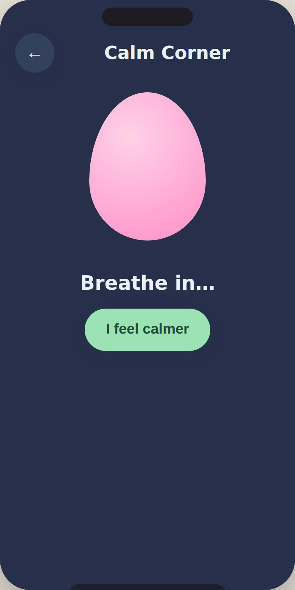
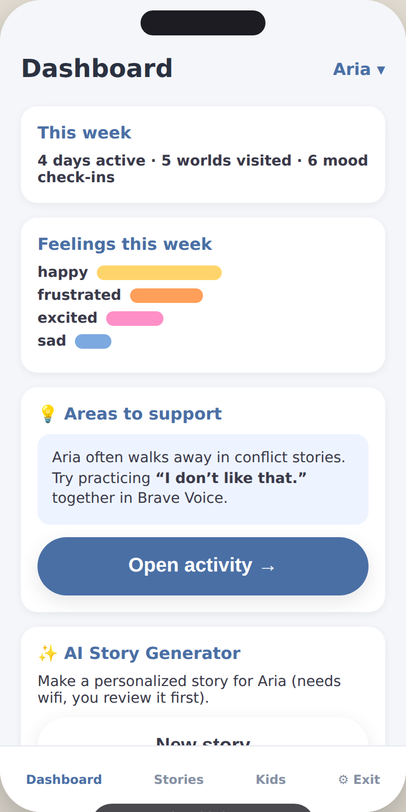

# Feel Friends 🐻💛

**A social-emotional learning (SEL) mobile app for children ages 3–6.**

Feel Friends helps preschool and kindergarten children recognize emotions,
communicate feelings, build social skills, set healthy boundaries, respond
to uncomfortable situations, and develop emotional regulation — through play,
not pressure.

> "Big feelings are okay. Let's learn about them together."

---

## What's in this repository

This is the **product design package** for Feel Friends. It contains the
full information architecture, user flows, wireframes, design system,
gamification strategy, MVP scope, and roadmap needed to build the app.

| Deliverable | Document |
|---|---|
| 🗺️ Information Architecture | [`docs/01-information-architecture.md`](docs/01-information-architecture.md) |
| 🧭 User Flows | [`docs/02-user-flows.md`](docs/02-user-flows.md) |
| 🖼️ Wireframes | [`docs/03-wireframes.md`](docs/03-wireframes.md) |
| 🎨 Design System | [`docs/04-design-system.md`](docs/04-design-system.md) |
| 🏆 Gamification Strategy | [`docs/05-gamification-strategy.md`](docs/05-gamification-strategy.md) |
| ✅ MVP Feature List | [`docs/06-mvp-feature-list.md`](docs/06-mvp-feature-list.md) |
| 🚀 Future Roadmap | [`docs/07-future-roadmap.md`](docs/07-future-roadmap.md) |
| 📚 Content Library (emotions & stories) | [`docs/08-content-library.md`](docs/08-content-library.md) |
| 🔒 Safety, Privacy & Accessibility | [`docs/09-safety-privacy-accessibility.md`](docs/09-safety-privacy-accessibility.md) |
| 🔍 Reference Benchmark (*Breathe, Think, Do*) | [`docs/10-reference-breathe-think-do.md`](docs/10-reference-breathe-think-do.md) |

### Preview

Live renders of the prototype (captured headless via Chromium with
`tests/screenshot.js`):

| | | |
|:--:|:--:|:--:|
|  |  |  |
| Friendly Town home | Daily mood check-in | Emotion Explorer · Face Match |
|  |  |  |
| Story Adventures | Brave Voice | Empathy Lab |
|  |  |  |
| Good Choice Challenge | Sticker Book | Calm Corner (breathing) |
|  | | |
| Parent Dashboard (grown-up) | | |

### Interactive prototype

A self-contained, no-build HTML prototype demonstrating the design system and
several key screens lives in [`prototype/index.html`](prototype/index.html).
Open it in any modern browser (or on a phone) to feel the look, scale of
touch targets, and core interactions.

```bash
# from the repo root
open prototype/index.html        # macOS
xdg-open prototype/index.html    # Linux
# or just double-click the file
```

---

## The six "Feel Friends" worlds (core features)

1. **Emotion Explorer** — recognize and name 10 core emotions through games,
   face-matching, daily mood check-ins, and a collectible emotion-card deck.
2. **Story Adventures** — interactive animated scenarios (sharing, being
   pushed, exclusion, teasing, turn-taking, asking for help) with
   choose-your-response, consequence-based learning.
3. **Brave Voice** — practice assertive phrases ("Please stop." / "I don't
   like that." / "Can I have help?" / "Can I play too?") with optional voice
   recording.
4. **Calm Corner** — breathing exercises, the balloon-breath game, a glitter
   jar, counting, and short mindfulness moments for emotional regulation.
5. **Empathy Lab** — perspective-taking, "how does *this* friend feel?", and
   kindness activities.
6. **Good Choice Challenge** — quick decision-making games with positive
   reinforcement and animated outcomes.

Plus, for grown-ups:

- **Parent Dashboard** — progress, emotion trends, areas needing support, and
  weekly reports.
- **AI Story Generator** — personalized social stories with the child's name
  and parent-described situations.

---

## Design principles

- **Feelings first, no failure.** There are no wrong answers, only "let's try
  another way." Nothing is scored or ranked.
- **Minimal reading, maximum voice.** Every instruction is narrated. A
  non-reader can use the whole app.
- **Big, forgiving touch targets.** Designed for small, still-developing
  fine-motor skills.
- **Calm by design.** Bright and friendly, never loud or frantic. No
  manipulative streaks, timers, or loss-aversion mechanics.
- **Child-safe.** No ads, no open chat, no external links in child mode, no
  data sold. Parent gate protects all settings and the dashboard.
- **Works offline.** Core lessons are downloaded and playable without a
  connection.

See [`docs/04-design-system.md`](docs/04-design-system.md) and
[`docs/09-safety-privacy-accessibility.md`](docs/09-safety-privacy-accessibility.md)
for the full rationale.

---

## Suggested tech direction (non-binding)

The design is platform-agnostic. A reasonable build path:

- **Cross-platform client:** React Native (Expo) or Flutter — one codebase for
  iOS + Android, strong offline + asset support.
- **Local-first storage:** on-device DB (SQLite/WatermelonDB or Hive/Isar) so
  core lessons and progress work offline; sync when online.
- **Audio:** pre-recorded professional VO for all core content; on-device TTS
  only as an accessibility fallback.
- **AI Story Generator:** server-side LLM call (Claude) gated behind the
  parent account, with strict child-safe prompt constraints and human-readable
  output review. Never runs in child mode without a parent present.
- **Auth:** parent email/SSO; child profiles are local sub-profiles with no
  PII required.

These are recommendations, not requirements — see the roadmap for phasing.
