# Feel Friends 🐻💛

**A social-emotional learning (SEL) mobile app for children ages 3–6.**

Feel Friends helps preschool and kindergarten children recognize emotions,
communicate feelings, build social skills, set healthy boundaries, respond
to uncomfortable situations, and develop emotional regulation — through play,
not pressure.

> "Big feelings are okay. Let's learn about them together."

---

## 🚀 The working app (`app/`)

This repo contains a **fully functional Feel Friends app** — an installable,
offline-capable Progressive Web App (PWA) built with vanilla JS (no build
step). It is not a mockup: games are playable, progress persists on-device,
voice narration speaks, the microphone records, and the parent dashboard shows
real analytics derived from actual play.

```bash
npm install          # dev tooling for tests (the app itself needs no deps)
npm start            # serve the app  ->  http://localhost:5173/
```

Open it on a phone (same network) or in a desktop browser, and "Add to Home
Screen" to install it like a native app. It keeps working with no connection.

**What actually works today:**

- **Onboarding** → creates a local child profile (name, age band, avatar).
- **Daily mood check-in** → records the feeling, validates it, suggests Calm
  Corner for hard feelings.
- **Emotion Explorer** → Face Match + Name That Feeling (no-fail), and a
  collectible 10-card deck that flips to teach each feeling.
- **Story Adventures** → 4 branching scenarios with real consequences + a
  bridge into Brave Voice.
- **Brave Voice** → narrated modelling + real microphone recording with
  playback/delete (local-only), graceful echo mode without a mic.
- **Calm Corner** → balloon breathing, an animated glitter-jar canvas,
  5-4-3-2-1 grounding, quiet listen — reachable from every screen.
- **Empathy Lab** & **Good Choice Challenge** → working rounds + kindness
  missions.
- **Rewards** → cards + stickers persist; Sticker Book aggregates them. No
  scores/streaks/timers.
- **Parent gate** (hold + arithmetic) → **Parent Dashboard** with live emotion
  trends, progress, and a personalized support insight, plus **Settings**
  (narration/SFX/reduce-motion, data export, delete-all).
- **Offline** via a service worker; **installable** via the web manifest;
  **voice narration** via the Web Speech API.

### Tests (the app is verified, not just claimed)

```bash
npm test             # 129 assertions — design-system prototype + docs (jsdom)
npm run test:e2e     # 40 assertions — drives the REAL app in Chromium end-to-end
```

The e2e suite (`tests/app.e2e.js`) walks the whole journey in a real browser:
onboarding → check-in → games → stories → mic recording → calm → empathy →
choice → sticker book → parent gate → dashboard, and verifies **data persists
across reload** and **the app loads while offline**. Latest run: **40/40 pass**.

> `npm run test:e2e` boots its own server. In some locked-down sandboxes that
> child-process server is killed; if so, run `npm start` in one terminal and
> `BASE=http://localhost:5173 node tests/app.e2e.js` in another.

---

## Design package (`docs/`)

Alongside the working app, this repo contains the full **product design
package**: information architecture, user flows, wireframes, design system,
gamification strategy, MVP scope, and roadmap.

| Deliverable | Document |
|---|---|
| 🗺️ Information Architecture | [`docs/01-information-architecture.md`](docs/01-information-architecture.md) |
| 🧭 User Flows | [`docs/02-user-flows.md`](docs/02-user-flows.md) |
| 🖼️ Wireframes | [`docs/03-wireframes.md`](docs/03-wireframes.md) |
| 🎨 Design System | [`docs/04-design-system.md`](docs/04-design-system.md) |
| 🏆 Gamification Strategy | [`docs/05-gamification-strategy.md`](docs/05-gamification-strategy.md) |
| ✅ MVP Feature List | [`docs/06-mvp-feature-list.md`](docs/06-mvp-feature-list.md) |
| 🚀 Future Roadmap | [`docs/07-future-roadmap.md`](docs/07-future-roadmap.md) |
| 📚 Content Library (emotions & stories) | [`docs/08-content-library.md`](docs/08-content-library.md) |
| 🔒 Safety, Privacy & Accessibility | [`docs/09-safety-privacy-accessibility.md`](docs/09-safety-privacy-accessibility.md) |
| 🔍 Reference Benchmark (*Breathe, Think, Do*) | [`docs/10-reference-breathe-think-do.md`](docs/10-reference-breathe-think-do.md) |

### Preview — the real app

Live screenshots captured from the **running app** (`tests/app-screens.js`),
with real on-device state:

| | | |
|:--:|:--:|:--:|
| 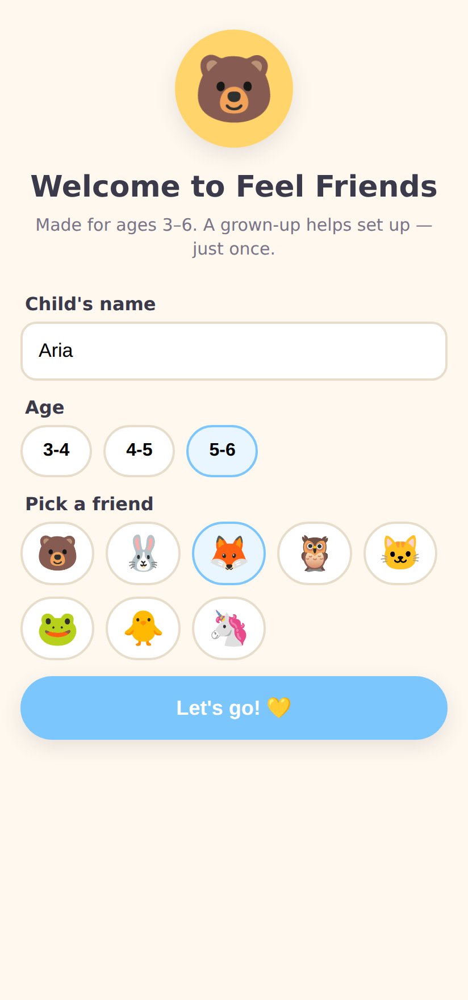 | 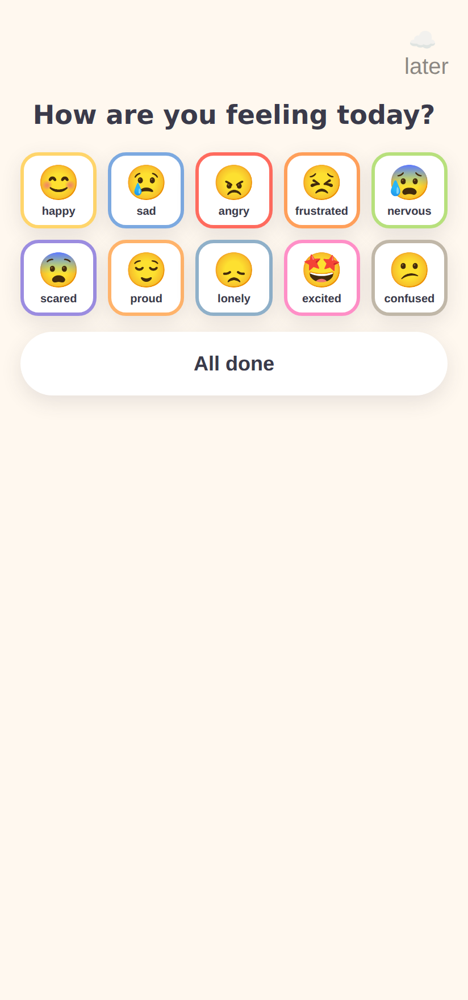 | 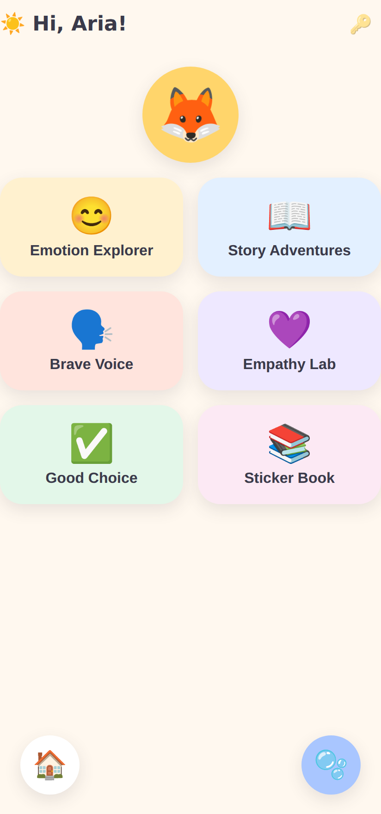 |
| Onboarding | Daily mood check-in | Friendly Town home |
| 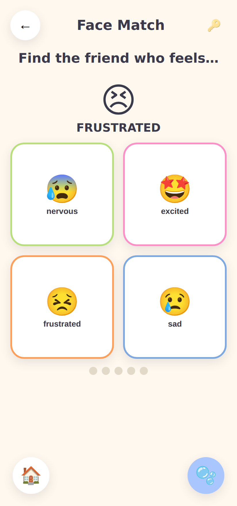 | 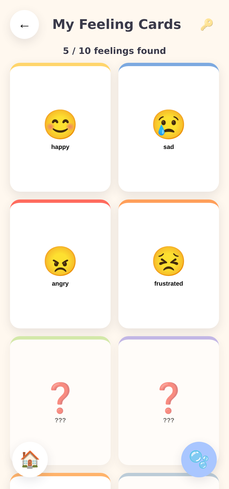 | 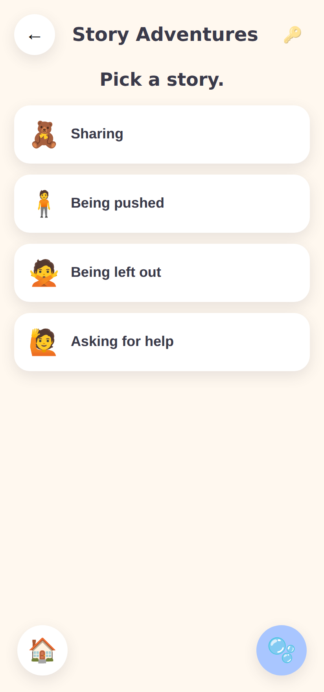 |
| Face Match | Collectible feeling cards | Story Adventures |
| 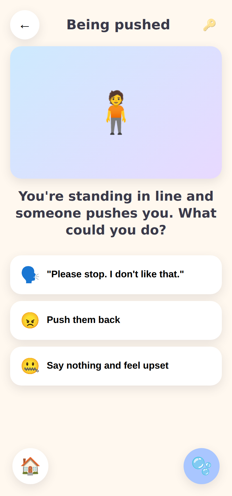 | 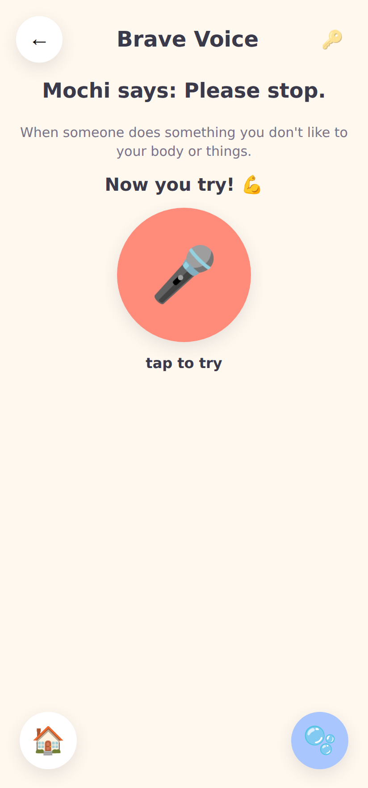 |  |
| Story (branching) | Brave Voice (mic) | Calm Corner |
| 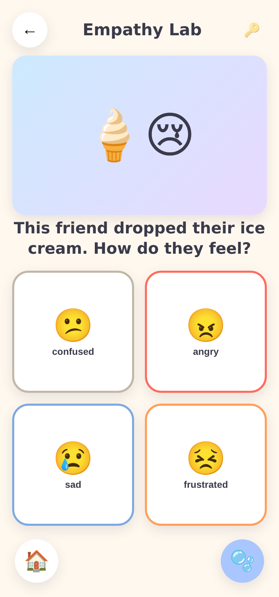 | 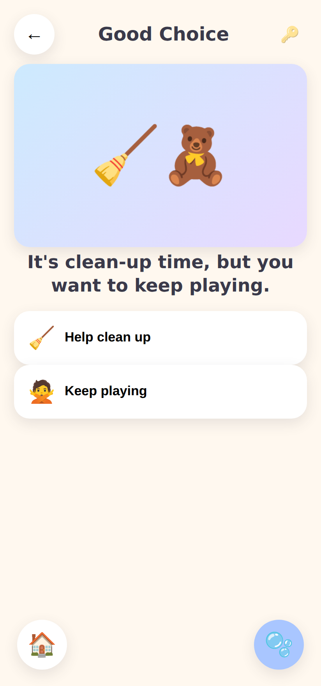 | 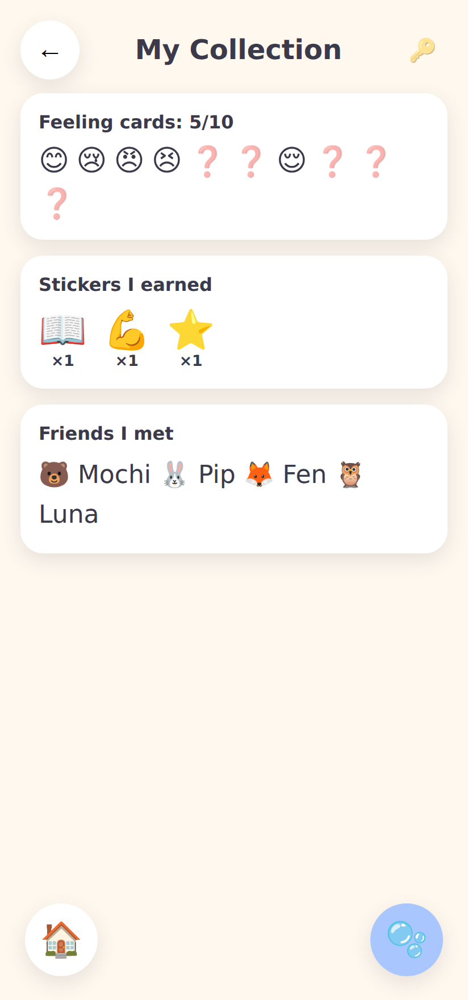 |
| Empathy Lab | Good Choice | Sticker Book |
| 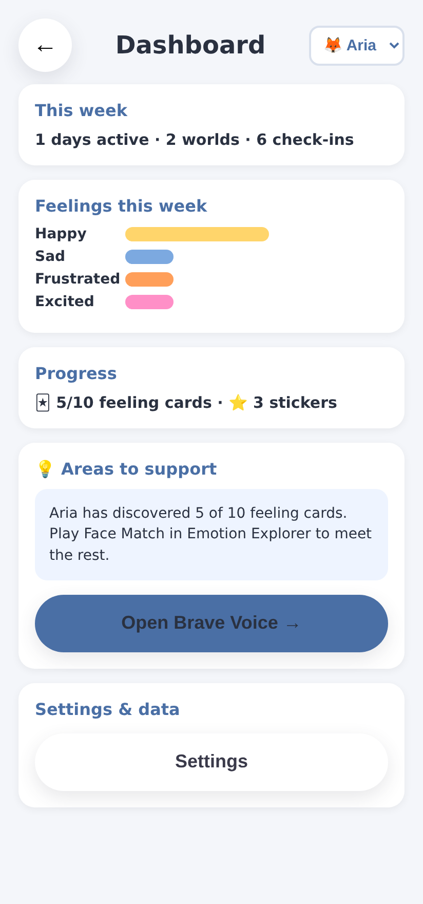 | | |
| Parent Dashboard (live data) | | |

### Early design prototype (`prototype/`)

A self-contained, single-file HTML prototype from the design phase lives in
[`prototype/index.html`](prototype/index.html). It predates the full app and is
kept as a design reference. For the real experience, run the app in `app/`.

```bash
# from the repo root
open prototype/index.html        # macOS
xdg-open prototype/index.html    # Linux
# or just double-click the file
```

---

## The six "Feel Friends" worlds (core features)

1. **Emotion Explorer** — recognize and name 10 core emotions through games,
   face-matching, daily mood check-ins, and a collectible emotion-card deck.
2. **Story Adventures** — interactive animated scenarios (sharing, being
   pushed, exclusion, teasing, turn-taking, asking for help) with
   choose-your-response, consequence-based learning.
3. **Brave Voice** — practice assertive phrases ("Please stop." / "I don't
   like that." / "Can I have help?" / "Can I play too?") with optional voice
   recording.
4. **Calm Corner** — breathing exercises, the balloon-breath game, a glitter
   jar, counting, and short mindfulness moments for emotional regulation.
5. **Empathy Lab** — perspective-taking, "how does *this* friend feel?", and
   kindness activities.
6. **Good Choice Challenge** — quick decision-making games with positive
   reinforcement and animated outcomes.

Plus, for grown-ups:

- **Parent Dashboard** — progress, emotion trends, areas needing support, and
  weekly reports.
- **AI Story Generator** — personalized social stories with the child's name
  and parent-described situations.

---

## Design principles

- **Feelings first, no failure.** There are no wrong answers, only "let's try
  another way." Nothing is scored or ranked.
- **Minimal reading, maximum voice.** Every instruction is narrated. A
  non-reader can use the whole app.
- **Big, forgiving touch targets.** Designed for small, still-developing
  fine-motor skills.
- **Calm by design.** Bright and friendly, never loud or frantic. No
  manipulative streaks, timers, or loss-aversion mechanics.
- **Child-safe.** No ads, no open chat, no external links in child mode, no
  data sold. Parent gate protects all settings and the dashboard.
- **Works offline.** Core lessons are downloaded and playable without a
  connection.

See [`docs/04-design-system.md`](docs/04-design-system.md) and
[`docs/09-safety-privacy-accessibility.md`](docs/09-safety-privacy-accessibility.md)
for the full rationale.

---

## Suggested tech direction (non-binding)

The design is platform-agnostic. A reasonable build path:

- **Cross-platform client:** React Native (Expo) or Flutter — one codebase for
  iOS + Android, strong offline + asset support.
- **Local-first storage:** on-device DB (SQLite/WatermelonDB or Hive/Isar) so
  core lessons and progress work offline; sync when online.
- **Audio:** pre-recorded professional VO for all core content; on-device TTS
  only as an accessibility fallback.
- **AI Story Generator:** server-side LLM call (Claude) gated behind the
  parent account, with strict child-safe prompt constraints and human-readable
  output review. Never runs in child mode without a parent present.
- **Auth:** parent email/SSO; child profiles are local sub-profiles with no
  PII required.

These are recommendations, not requirements — see the roadmap for phasing.
